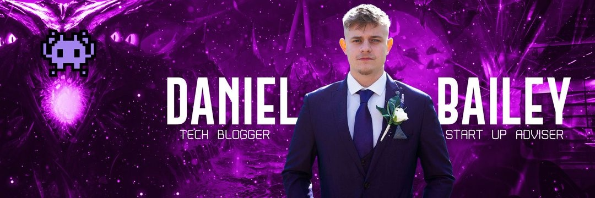

### Hi there 👋, my name is Daniel
#### DevTool + OSS Enthusiast

I'm Daniel Bailey, a tech enthusiast currently enrolled in CS50 to broaden my depth of knowledge and truly relate to the engineers I talk to on a daily basis. I'm currently working with C to fight the challenges of cs50! Previously I have dabbled in HTML, CSS, and fractional amounts of JS (Find the website I made below 😊) To contact me, my LinkedIn profile is best :)

Skills: HTML / CSS / C (soon) / Technical Recruitment / Sales

- ✅ Step 1: Make a website - https://dandwb.github.io/New-Draft-site/ 
- ✅ Step 2: Become a technical blogger - https://medium.com/@danbaileydwb
- ✅ Step 3: Read my first (of many) book - The Challenger Sale
- ✅ Step 3: Get AZ-900 certified
- 🟠 Step 4: Complete CS50
- 🌎 Step 5: Take over the world
- 📫 How to reach me: LinkedIn/Email - Links Below 
- ⚡ Me: I LOVEEE fueling my curiosity
 
  

  

## Contact 

 
   
  
  
 
 

